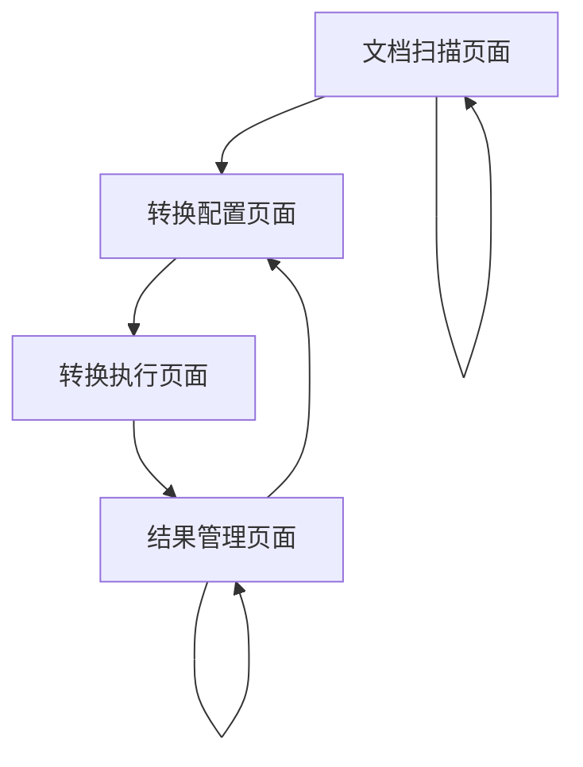

# HTML转Markdown工具产品需求文档

## 1. 产品概述

本产品是一个专门用于批量转换HTML/MHTML文档为Markdown格式的工具，主要解决技术文档管理和知识库建设中的格式转换问题。

- 目标用户：技术文档管理员、知识库维护人员、开发团队
- 核心价值：提高文档处理效率，统一文档格式，便于知识库管理和检索

## 2. 核心功能

### 2.1 用户角色

本工具为单用户工具，无需区分用户角色。

### 2.2 功能模块

我们的HTML转Markdown工具包含以下主要功能：

1. **文档扫描页面**：文件夹扫描、文档预览、格式检测
2. **转换配置页面**：转换选项设置、输出路径配置、批量处理设置
3. **转换执行页面**：实时转换进度、错误日志显示、转换结果预览
4. **结果管理页面**：转换结果查看、文件对比、质量检查

### 2.3 页面详情

| 页面名称 | 模块名称 | 功能描述 |
|---------|---------|----------|
| 文档扫描页面 | 文件夹扫描 | 递归扫描指定文件夹，识别HTML/MHTML文件，显示文件列表和基本信息 |
| 文档扫描页面 | 文档预览 | 显示选中文档的内容预览，支持HTML渲染和源码查看 |
| 文档扫描页面 | 格式检测 | 自动检测文档编码、文档类型、内容结构等信息 |
| 转换配置页面 | 转换选项设置 | 配置Markdown输出格式、图片处理方式、链接处理策略等 |
| 转换配置页面 | 输出路径配置 | 设置输出目录、文件命名规则、目录结构保持策略 |
| 转换配置页面 | 批量处理设置 | 配置并发处理数量、错误处理策略、进度通知方式 |
| 转换执行页面 | 实时转换进度 | 显示当前转换进度、处理速度、剩余时间估算 |
| 转换执行页面 | 错误日志显示 | 实时显示转换过程中的错误信息、警告信息和处理建议 |
| 转换执行页面 | 转换结果预览 | 实时预览已转换的Markdown文件内容和格式效果 |
| 结果管理页面 | 转换结果查看 | 浏览所有转换完成的文件，支持文件夹树形结构显示 |
| 结果管理页面 | 文件对比 | 对比原始HTML文件和转换后的Markdown文件，检查转换质量 |
| 结果管理页面 | 质量检查 | 自动检测转换质量问题，如丢失内容、格式错误等 |

## 3. 核心流程

用户使用流程：
1. 启动工具，进入文档扫描页面
2. 选择包含HTML/MHTML文档的源文件夹（document文件夹）
3. 系统自动扫描并显示所有可转换的文档列表
4. 用户可预览文档内容，确认转换范围
5. 进入转换配置页面，设置转换参数和输出选项
6. 配置输出目录和文件组织方式
7. 开始批量转换，进入转换执行页面
8. 实时监控转换进度和处理结果
9. 转换完成后，进入结果管理页面查看和验证结果
10. 可选择重新转换有问题的文件或调整配置

## 4. 用户界面设计

### 4.1 设计风格

- **主色调**：蓝色系（#2563eb）作为主色，灰色系（#64748b）作为辅助色
- **按钮风格**：现代扁平化设计，圆角按钮，悬停效果
- **字体**：系统默认字体，标题使用16-20px，正文使用14px，代码使用等宽字体
- **布局风格**：左侧导航栏 + 主内容区域，卡片式布局，响应式设计
- **图标风格**：使用简洁的线性图标，支持文件类型、状态指示等场景

### 4.2 页面设计概览

| 页面名称 | 模块名称 | UI元素 |
|---------|---------|--------|
| 文档扫描页面 | 文件夹扫描 | 文件夹选择器、文件树形列表、文件信息卡片、搜索过滤框 |
| 文档扫描页面 | 文档预览 | 分屏布局、HTML渲染区域、源码查看器、切换标签页 |
| 转换配置页面 | 转换选项设置 | 表单控件、选项卡、预设配置下拉框、实时预览区域 |
| 转换执行页面 | 实时转换进度 | 进度条、状态指示器、统计数据面板、日志滚动区域 |
| 结果管理页面 | 转换结果查看 | 文件管理器界面、预览面板、操作按钮组、状态标签 |

### 4.3 响应式设计

本工具主要面向桌面端使用，采用桌面优先的响应式设计。支持最小1024px宽度的显示器，在较小屏幕上会自动调整布局，隐藏次要功能，保证核心功能的可用性。