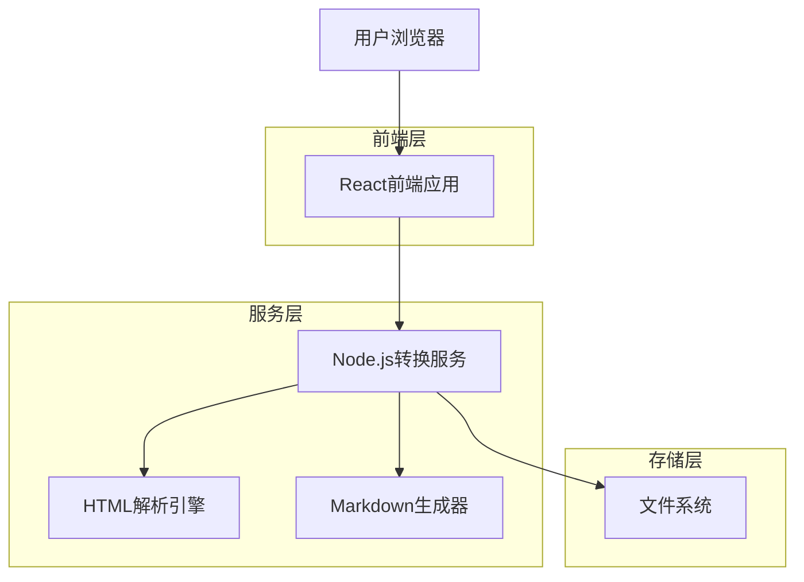
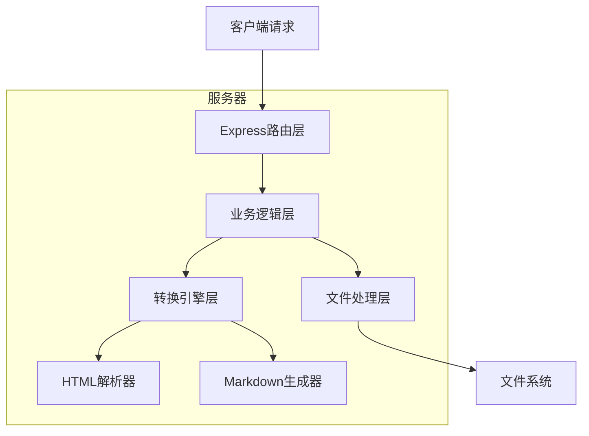
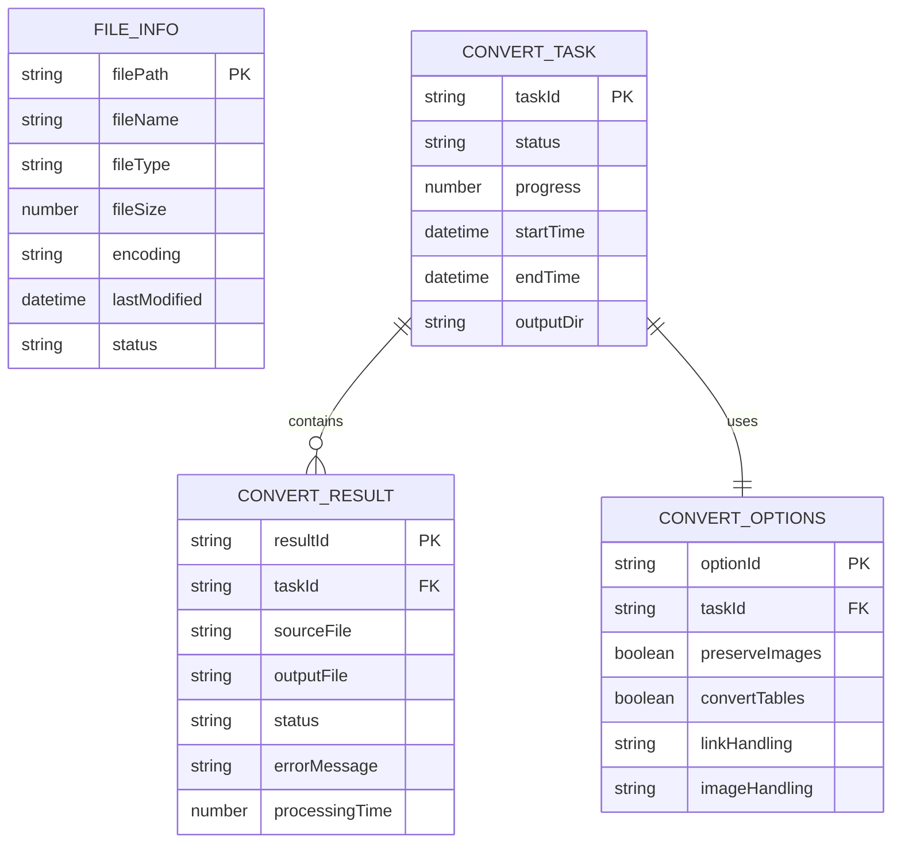

# HTML转Markdown工具技术架构文档

## 1. 架构设计



## 2. 技术描述

* **前端**: React\@18 + TypeScript + Tailwind CSS + Vite

* **后端**: Node.js\@22 + Express\@4 + TypeScript

* **核心库**:

  * HTML解析: jsdom\@24

  * Markdown转换: turndown\@7

  * 文件处理: fs-extra\@11

  * MHTML解析: mhtml2html\@2

## 3. 路由定义

| 路由       | 用途               |
| -------- | ---------------- |
| /        | 主页面，文档扫描和管理界面    |
| /scan    | 文档扫描页面，显示文件列表和预览 |
| /config  | 转换配置页面，设置转换参数    |
| /convert | 转换执行页面，显示转换进度    |
| /results | 结果管理页面，查看转换结果    |

## 4. API定义

### 4.1 核心API

**文件扫描相关**

```
POST /api/scan/folder
```

Request:

| 参数名               | 参数类型      | 是否必需  | 描述        |
| ----------------- | --------- | ----- | --------- |
| folderPath        | string    | true  | 要扫描的文件夹路径 |
| includeSubfolders | boolean   | false | 是否包含子文件夹  |
| fileTypes         | string\[] | false | 文件类型过滤    |

Response:

| 参数名        | 参数类型        | 描述       |
| ---------- | ----------- | -------- |
| success    | boolean     | 扫描是否成功   |
| files      | FileInfo\[] | 扫描到的文件列表 |
| totalCount | number      | 文件总数     |

**文档转换相关**

```
POST /api/convert/batch
```

Request:

| 参数名       | 参数类型           | 是否必需  | 描述         |
| --------- | -------------- | ----- | ---------- |
| files     | string\[]      | true  | 要转换的文件路径列表 |
| outputDir | string         | true  | 输出目录路径     |
| options   | ConvertOptions | false | 转换选项配置     |

Response:

| 参数名    | 参数类型   | 描述     |
| ------ | ------ | ------ |
| taskId | string | 转换任务ID |
| status | string | 任务状态   |

**转换进度查询**

```
GET /api/convert/progress/:taskId
```

Response:

| 参数名            | 参数类型            | 描述          |
| -------------- | --------------- | ----------- |
| taskId         | string          | 任务ID        |
| progress       | number          | 转换进度(0-100) |
| currentFile    | string          | 当前处理的文件     |
| completedCount | number          | 已完成文件数      |
| totalCount     | number          | 总文件数        |
| errors         | ConvertError\[] | 错误信息列表      |

## 5. 服务器架构图



## 6. 数据模型

### 6.1 数据模型定义



### 6.2 TypeScript类型定义

```typescript
// 文件信息接口
interface FileInfo {
  filePath: string;
  fileName: string;
  fileType: 'html' | 'mhtml';
  fileSize: number;
  encoding: string;
  lastModified: Date;
  status: 'pending' | 'processing' | 'completed' | 'error';
}

// 转换选项接口
interface ConvertOptions {
  preserveImages: boolean;
  convertTables: boolean;
  linkHandling: 'preserve' | 'remove' | 'convert';
  imageHandling: 'embed' | 'link' | 'download';
  outputFormat: 'standard' | 'github' | 'custom';
  customRules?: CustomRule[];
}

// 转换任务接口
interface ConvertTask {
  taskId: string;
  status: 'pending' | 'running' | 'completed' | 'failed';
  progress: number;
  startTime: Date;
  endTime?: Date;
  outputDir: string;
  files: string[];
  options: ConvertOptions;
}

// 转换结果接口
interface ConvertResult {
  resultId: string;
  taskId: string;
  sourceFile: string;
  outputFile: string;
  status: 'success' | 'error' | 'warning';
  errorMessage?: string;
  processingTime: number;
  warnings?: string[];
}

// 转换错误接口
interface ConvertError {
  file: string;
  error: string;
  line?: number;
  suggestion?: string;
}
```

## 7. 核心算法设计

### 7.1 HTML解析流程

1. **文件类型检测**: 自动识别HTML/MHTML格式
2. **编码检测**: 自动检测文件编码（UTF-8, GBK等）
3. **MHTML解包**: 提取MHTML中的HTML内容和资源
4. **DOM解析**: 使用jsdom解析HTML结构
5. **内容清理**: 移除脚本、样式等非内容元素
6. **结构分析**: 识别标题、段落、列表、表格等结构

### 7.2 Markdown转换策略

1. **标题转换**: H1-H6标签转换为对应的Markdown标题
2. **段落处理**: 保持段落结构，处理换行和空格
3. **列表转换**: 有序和无序列表的嵌套处理
4. **表格转换**: HTML表格转换为Markdown表格格式
5. **链接处理**: 内部链接和外部链接的不同处理策略
6. **图片处理**: 图片的下载、转换和引用处理
7. **代码块**: 识别和保持代码块格式

### 7.3 文件组织策略

1. **目录结构保持**: 维持原有的文件夹层次结构
2. **文件命名**: 自动处理特殊字符，确保文件名合法
3. **重复处理**: 处理同名文件的冲突问题
4. **资源管理**: 统一管理图片等资源文件
5. **索引生成**: 可

